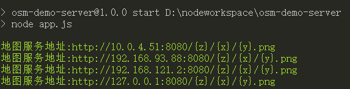

## 地图爬取
### 安装地图爬虫
`npm install`

###  使用帮助
`npm run start -- --help`

###  样例
```shell
npm run start "https://tile.openstreetmap.org/{z}/{x}/{y}.png" -- --zoom=1-3 --extent=84.9,-178.0,-84.9,178.0 --output=D:\\tilescache
```
> 上面这条命令是爬取 openstreetmap 官网地图的 1-3 层，范围是全球，缓存的图片输出到 D:\\\\tilescache 目录

###  开发指南
```shell
npm run build:watch
```
如果是使用vscode工具开发，通过F5就可以进行断点调试了。


## 地图服务部署

###  演示机器环境
1. Win32/Linux
1. Node 10.15.0

###  制作地图服务包

1. 将地图缓存切图复制到 tilecache 目录下，切图格式为,请务必检查下切图格式是否如下：

```
--tilecache
   |-4
   |--6
   |----7.png
   |----8.png
   |-5
   |--3
   |----2.png
   |----4.png
```

###  启动（测试）
1. 执行 `npm start` 如果出现如下提示，说明地图服务已启动：

1. 将地图服务对接到应用进行测试，如果可以正常显示说明部署成功。

### 部署
1. 将整个项目打包到部署的机器上执行启动即可。

###  配置
[config.js](src/config.js)


## FAQ
Q：部署对机器配置有什么要求吗？
> A：除了需要预装node环境外基本没有，因为只是启动了一个非常轻量的http服务去缓存几万张静态图片。

Q:正常的生产环境可以用这套服务吗？
> A: 完全不可以！他不支持换肤，图层极少，没有负载均衡，只能作为轻量演示系统使用。